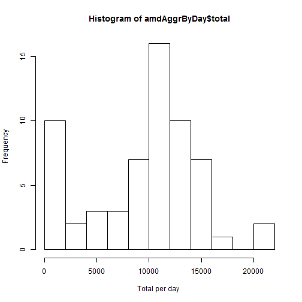
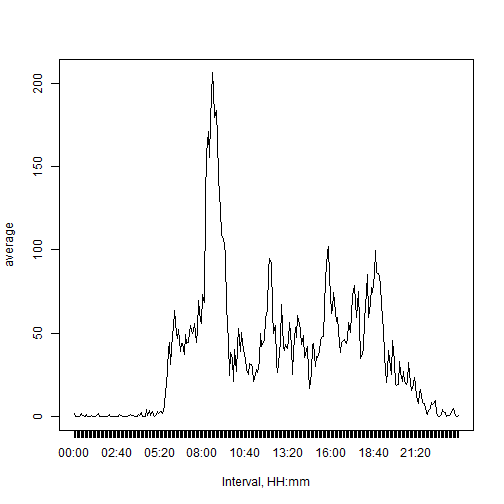
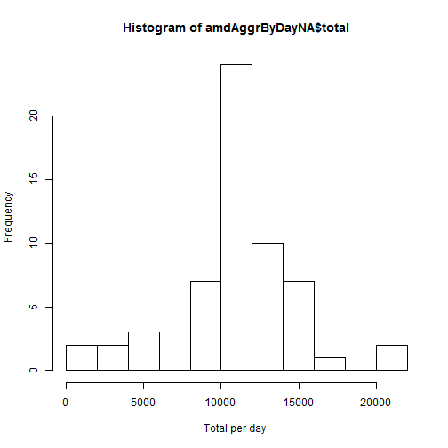
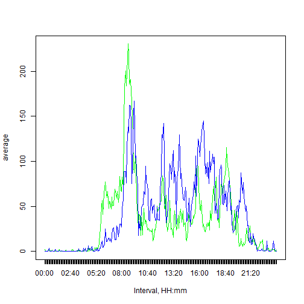

*author: "Natalia Udaltsova"*
*date: "Tuesday, June 23, 2015"*

## Introduction

It is now possible to collect a large amount of data about personal movement using activity monitoring devices such as a Fitbit, Nike Fuelband, or Jawbone Up. These type of devices are part of the “quantified self” movement – a group of enthusiasts who take measurements about themselves regularly to improve their health, to find patterns in their behavior, or because they are tech geeks. But these data remain under-utilized both because the raw data are hard to obtain and there is a lack of statistical methods and software for processing and interpreting the data.

This assignment makes use of data from a personal activity monitoring device. This device collects data at 5 minute intervals through out the day. The data consists of two months of data from an anonymous individual collected during the months of October and November, 2012 and include the number of steps taken in 5 minute intervals each day.

### Data

The data for this assignment can be downloaded from the course web site: [Activity monitoring data, 52K](https://d396qusza40orc.cloudfront.net/repdata%2Fdata%2Factivity.zip)

The dataset is stored in a comma-separated-value (CSV) file and there are a total of 17,568 observations in this dataset.

The variables included in this dataset are:

- steps: Number of steps taking in a 5-minute interval (missing values are coded as NA)

- date: The date on which the measurement was taken in MM/DD/YYYY format

- interval: Identifier for the 5-minute interval in which measurement was taken

## Assignment

The assignment is described and implemented in multiple parts below

### I. Loading and preprocessing the data

Here we assume that the input data file **activity.csv** is unzipped and place to the same folder with this document.
Data is loaded using the read.csv function and looks like:

|    | steps |   date    | interval |
|:---|:-----:|:---------:|:--------:|
|285 |  NA   | 10/1/2012 |   2340   |
|286 |  NA   | 10/1/2012 |   2345   |
|287 |  NA   | 10/1/2012 |   2350   |
|288 |  NA   | 10/1/2012 |   2355   |
|289 |   0   | 10/2/2012 |    0     |
|290 |   0   | 10/2/2012 |    5     |
|291 |   0   | 10/2/2012 |    10    |
|292 |   0   | 10/2/2012 |    15    |
|293 |   0   | 10/2/2012 |    20    |

After the loading, the *date* and *interval* column are formatted to present days, hours and munutes like YYYY-MM-DD hh:mm and a new column, rownumber (within a day), is assded for proper sorting. Now it liiks like :

|    | steps |    date    | interval | rownumber |
|:---|:-----:|:----------:|:--------:|:---------:|
|285 |  NA   | 2012-10-01 |  23:40   |    285    |
|286 |  NA   | 2012-10-01 |  23:45   |    286    |
|287 |  NA   | 2012-10-01 |  23:50   |    287    |
|288 |  NA   | 2012-10-01 |  23:55   |    288    |
|289 |   0   | 2012-10-02 |  00:00   |     1     |
|290 |   0   | 2012-10-02 |  00:05   |     2     |
|291 |   0   | 2012-10-02 |  00:10   |     3     |
|292 |   0   | 2012-10-02 |  00:15   |     4     |
|293 |   0   | 2012-10-02 |  00:20   |     5     |

### II. What is mean total number of steps taken per day? 

For this part of the assignment, we do ignore the missing values in the dataset (na.rm=TRUE)

1. Total number of steps taken per day results in a table of 61 rows. The head of the table is:

|    date    | total |
|:----------:|:-----:|
| 2012-10-01 |   3   |
| 2012-10-02 |  126  |
| 2012-10-03 | 11352 |
| 2012-10-04 | 12116 |
| 2012-10-05 | 13294 |

2. The histogram of the total number of steps taken each day (10 breaks): 

 

3. The mean and median of the total number of steps taken per day are **9354.3** and **10395.0** correspondingly

###  III. What is the average daily activity pattern? 

1. The average number of steps taken, averaged across all days, per 5-minute interval are shown on the plot below:

 

2. The th interval, on average across all the days in the dataset, contains the maximum number of steps which is **206.2**

###  IV. Imputing missing values

1. The total no of missing in the dataset is 2302 Data gaps are distributd per days, i.e. there are 61 days totally missed from the experiment, those days are:

|   |    date    | count |
|:--|:----------:|:-----:|
|1  | 2012-10-01 |  286  |
|8  | 2012-10-08 |  288  |
|32 | 2012-11-01 |  288  |
|35 | 2012-11-04 |  288  |
|40 | 2012-11-09 |  288  |
|41 | 2012-11-10 |  288  |
|45 | 2012-11-14 |  288  |
|61 | 2012-11-30 |  288  |

2. The assignment here is to devise a strategy for filling in all of the missing values in the dataset. If we dont want to do anything sophisticated here, the method of mean substitution is the candidate no 1. In general, the result of such a replacement can be biased, but if we assume that the daily pattern of steps/interval is repeatable, such an approach might make sense.

3. The new dataset, with NA replaced by averame per interval now look like:

|    | steps |    date    | interval | rownumber |
|:---|:-----:|:----------:|:--------:|:---------:|
|285 | 3.30  | 2012-10-01 |  23:40   |    285    |
|286 | 0.64  | 2012-10-01 |  23:45   |    286    |
|287 | 0.23  | 2012-10-01 |  23:50   |    287    |
|288 | 1.08  | 2012-10-01 |  23:55   |    288    |
|289 | 0.00  | 2012-10-02 |  00:00   |     1     |
|290 | 0.00  | 2012-10-02 |  00:05   |     2     |
|291 | 0.00  | 2012-10-02 |  00:10   |     3     |
|292 | 0.00  | 2012-10-02 |  00:15   |     4     |
|293 | 0.00  | 2012-10-02 |  00:20   |     5     |

4. The histogram of the total number of steps taken each day (10 breaks): 

 

The mean and median of the total number of steps with NA replaced taken per day are 10766.2 and 10766.2 correspondingly. If we compare this histrogram to the one section II we can see that low frequency area at the very beginning at the plot is now gone and the distribution is a bit more normal.

###  V. Weekdays and Weekend Patterns

The plot below the blue line shows the weekend daily pattern and the green one - weekdays.

 

At the choosen sample we can see that the most steps activity starts and finishes later on weeknds and more activities are performed over the weekends, and this is quite understandable .

